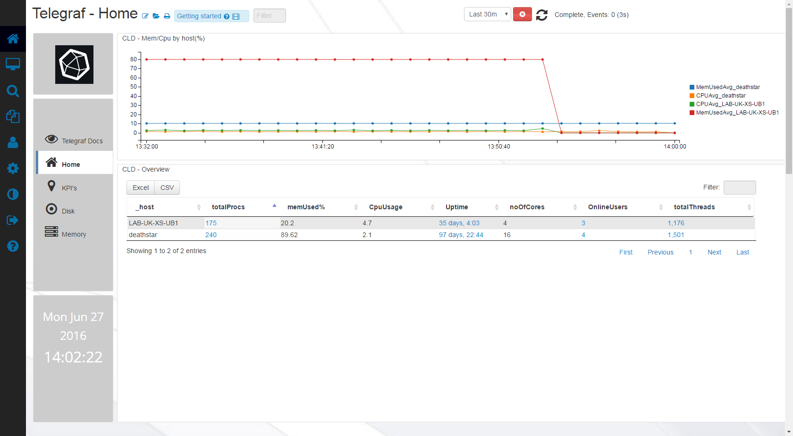
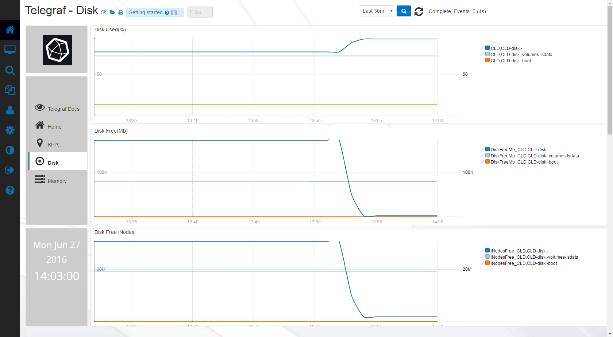
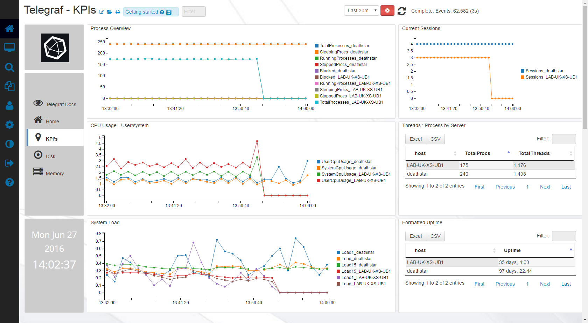
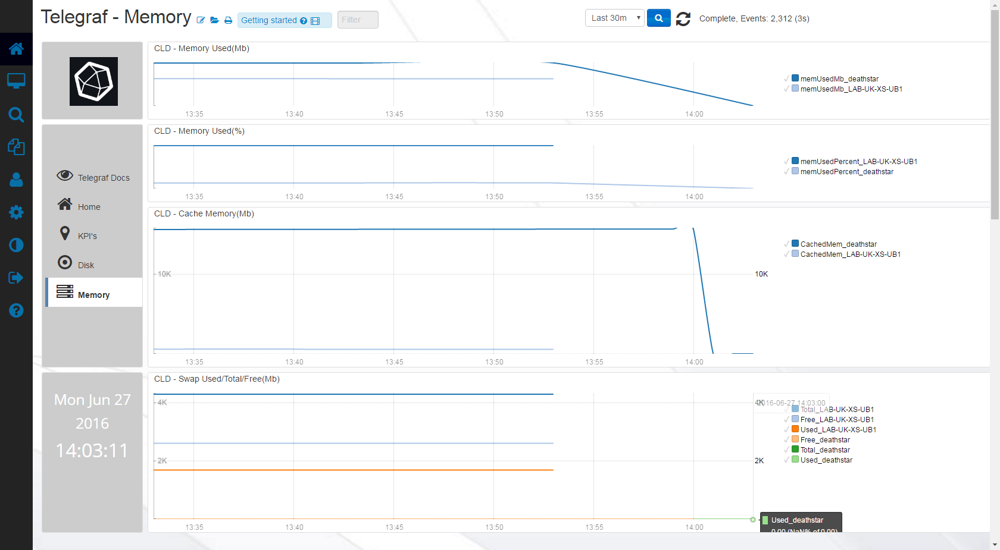

# Telegraf-Basic
##Telegraf-Basic requires version 3 of greater, of Logscape - [Download it today](https://logscape.com/get.html)

The Telegraf app utilizes data generated by the Telegraf software in order to monitor base machine stats including processes, diskio, system, kernel, swap, disk and memory.

It is meant to serve as an example of how Telegraf and Logscape are capable of interacting, to see what applications Telegraf is able to monitor - Check out the [documentation](https://docs.influxdata.com/telegraf/))

## Pre-Requisites

 * Pre-Installed Telegraf Instance
 * Telegraf conf set up to forward logs to your Logscape installations Socket Server

## Distributables

 * [TelegrafApp-1.0.zip](https://raw.githubusercontent.com/logscape/Telegraf-Basic/master/dist/TelegrafApp-1.0.zip)
 * [Telegraf.conf](https://raw.githubusercontent.com/logscape/Telegraf-Basic/master/dist/telegraf.conf)

## Overview

 
 
 
 